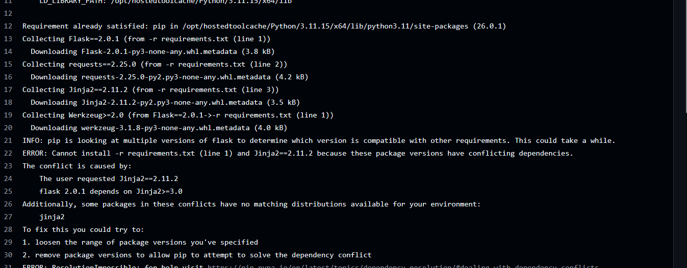
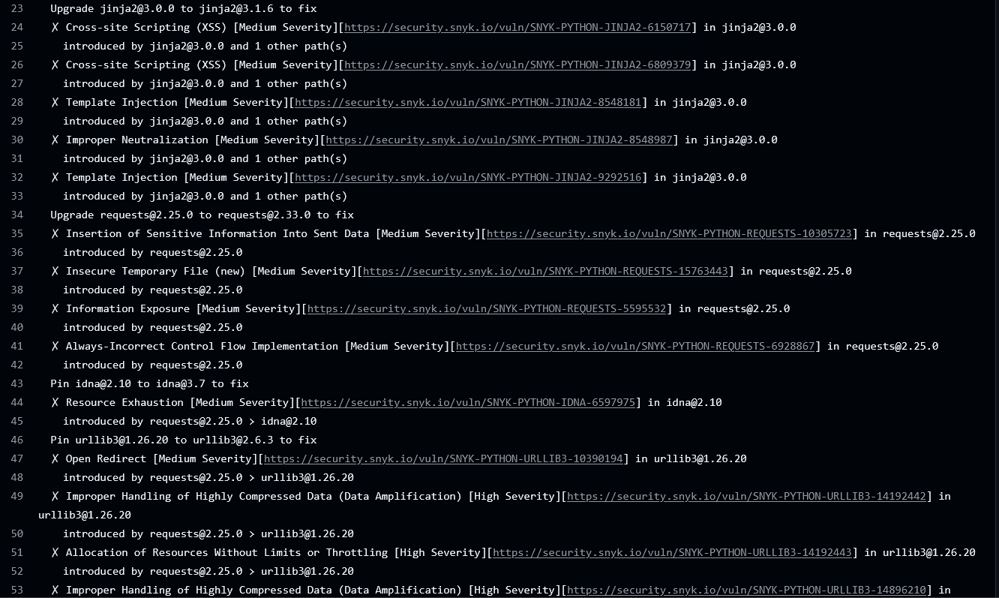
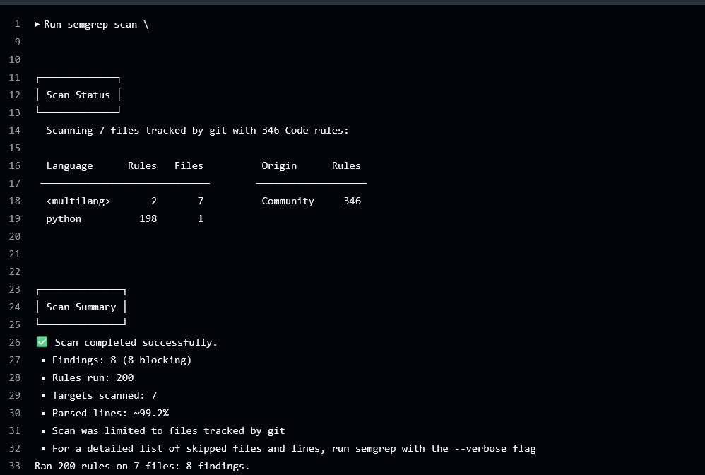

# RAPPORT EXERCICE 1 - AUDIT SÉCURITÉ

## 1. Résumé des vulnérabilités détectées

### Critiques

- SQL Injection dans la requête de recherche
- Utilisation dangereuse de `eval()`
- Secrets codés en dur dans le code source

### Haut risque

- XSS dans les champs `description` et `category`
- Absence de validation stricte des entrées utilisateur

### Moyen risque

- Logs SQL exposant les requêtes
- Absence de protection CSRF

---

## 2. Répartition des vulnérabilités

| Sévérité | Nombre |
|----------|--------|
| Critique | 3      |
| Haute    | 3      |
| Moyenne  | 2      |

---

## 3. Corrections appliquées

### Sécurité des secrets

- Utilisation de variables d'environnement

### SQL Injection

- Requêtes paramétrées SQLite

### XSS

- Utilisation de `markupsafe.escape`

### Code injection

- Suppression de `eval` non sécurisé ou restriction forte

---

## 4. Pourquoi la CI cassait

### A. Snyk — exit code 2

**Cause réelle :**

- Dépendances incompatibles pip
- Résolution impossible (Flask / Jinja2)

### B. SARIF absent

**Cause :**

- Snyk ne générait **pas** le fichier SARIF → donc `upload-sarif` échoue

---

## 5. Erreur logique dans le projet

Les versions suivantes étaient déclarées simultanément :

| Package | Version déclarée |
|---------|-----------------|
| Flask   | `2.0.1`         |
| Jinja2  | `2.11.2`        |

> ❌ Ces deux versions sont **incompatibles ensemble** et empêchent la résolution des dépendances.

**Correction :**

```txt
Flask==3.1.3
requests==2.33.0
```

> ✅ Jinja2, urllib3 et idna sont résolus automatiquement avec des versions compatibles.

---

## 6. Conclusion

Le code initial présentait plusieurs vulnérabilités critiques empêchant son déploiement en production.
Après correction, l'application respecte les bonnes pratiques OWASP.
